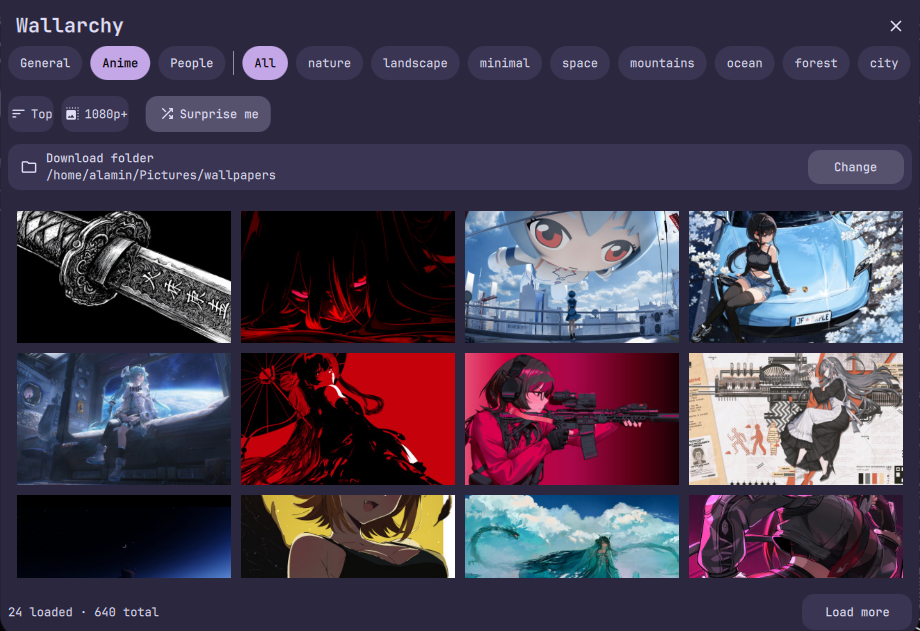

# Wallarchy

Wallarchy is a [DankMaterialShell](https://github.com/AvengeMedia/DankMaterialShell) plugin for browsing SFW wallpapers from [Wallhaven](https://wallhaven.cc/) and applying them directly through DMS.


## Screnshot
 <p align="center">
  
</p>
## Features

* Browse and Wallhaven wallpapers
* Filter by category and resolution
* Random wallpaper option
* Custom download directory
* Apply wallpapers directly through DMS
* SFW content only

## Requirements

* DankMaterialShell >= 1.6.0
* `curl`

## Installation
```bash
dms plugins install wallarchyDms
```


Then restart DMS.

## Usage

Add Wallarchy to your DankBar, open the widget, browse or search for a wallpaper, and click it to download and apply it.

Wallpapers are fetched using the Wallhaven API.

## Permissions

Wallarchy requires:

* `settings_read`
* `settings_write`
* `process`
* `network`

## Credits

* [Wallhaven](https://wallhaven.cc/)
* [DankMaterialShell](https://github.com/AvengeMedia/DankMaterialShell)

Wallarchy is an independent community plugin and is not affiliated with Wallhaven.
